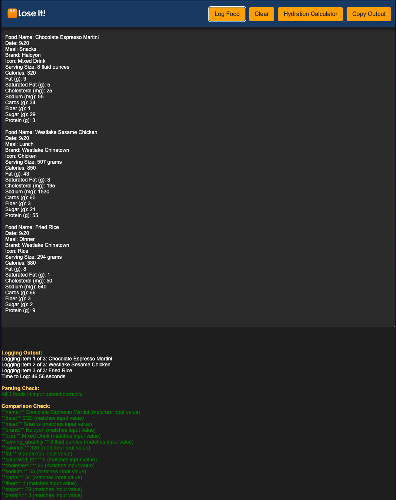
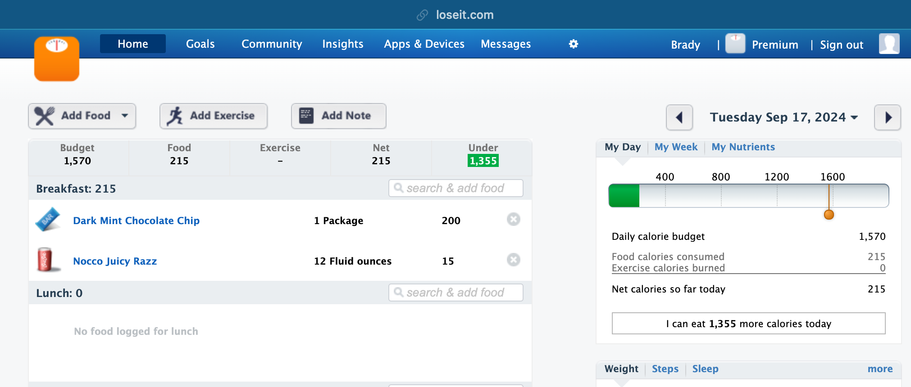
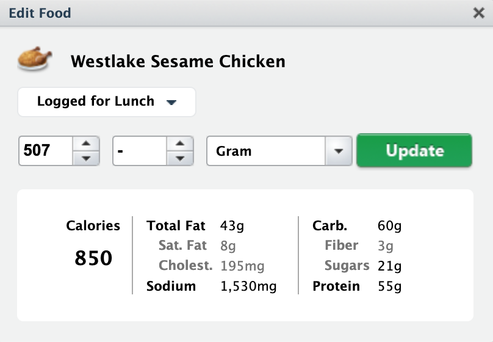
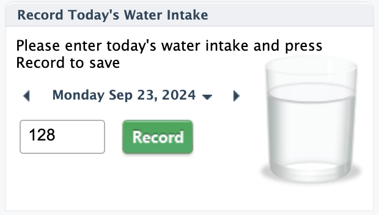

# Food Logging Automation

## Overview

**FoodLoggingAutomation** is a modular project designed to streamline logging food intake into the [Lose It!](https://loseit.com) website using Selenium automation. Users can submit their food details to a custom GPT which responds with formatted food item details ready to be logged into the system. The system automatically updates water intake when drinks or soups are logged.

It integrates with the [Estimate Nutritional Info GPT](https://chatgpt.com/g/g-VJEAwPuc8-estimate-nutritional-info), allowing users to query nutritional information. By copying the GPT's output into the web interface, the system logs meals, nutritional details, and updates water intake accurately.

The application uses **Google OAuth 2.0** for secure authentication and is deployed on **Heroku**, leveraging Selenium for browser automation. The project is modular for improved maintainability and scalability.

---

## Key Features

- **Automated Food and Water Logging**: Seamlessly log meals by querying nutritional info through GPT. The script automatically logs water intake when applicable.
- **Flask Web Application**: Provides a user-friendly interface for entering food data and working with GPT results.
- **Secure Google OAuth 2.0 Authentication**: Protects user credentials during access.
- **Accurate Data Logging**: Ensures nutritional data logged into Lose It! matches user input.
- **Comprehensive Error Handling and Logging**: Detailed logs and error reporting aid in troubleshooting.

---

## Screenshots

### Food Logging Interface
This is the main interface where users enter food data or paste nutritional info retrieved from GPT.



### Logged Food on Lose It!
After submitting food data, it automatically appears on your Lose It! account.




### Water Intake Logging
After submitting a drink or soup, the water intake is automatically updated in your Lose It! account.



---

## How It Works

1. **Query Nutritional Info via GPT**: Users ask the [Estimate Nutritional Info GPT](https://chatgpt.com/g/g-VJEAwPuc8-estimate-nutritional-info) about a meal. The GPT provides detailed nutritional data in a format ready for logging.
2. **Copy Results to Web App**: Copy the GPT results into the web app’s interface.
3. **Automated Logging**:
   - **Food Logging**: Selenium logs into Lose It!, navigates, and logs the provided food data.
   - **Water Intake Logging**: If applicable, the script automatically updates water intake based on the logged food item.
4. **Validation**: The system verifies that the data logged matches the input provided.
5. **Results**: A confirmation message displays once logging is complete, and food/water data appear on Lose It!.

---

## Deployment on Heroku

1. **Clone the Repository**:
   ```bash
   git clone https://github.com/yourusername/automated-food-logger.git
   cd automated-food-logger
   ```

2. **Set Environment Variables**:  
   Configure necessary environment variables (`LOSEIT_EMAIL`, `LOSEIT_PASSWORD`, `GOOGLE_CLIENT_ID`, `GOOGLE_CLIENT_SECRET`, etc.) on Heroku dashboard or CLI.

3. **Configure Buildpacks**:  
   Ensure Heroku buildpacks for Python and Chrome testing are set:
   ```bash
   heroku buildpacks:set heroku/python
   heroku buildpacks:add https://github.com/heroku/heroku-buildpack-chrome-for-testing.git
   ```

4. **Deploy**:  
   Push to GitHub connected with Heroku, or deploy manually:
   ```bash
   git push heroku main
   ```

5. **Access the Application**:  
   Visit `https://your-app-name.herokuapp.com/foodlog` to use the interface.

---

## Modular File Structure and Workflow

- **Authentication**: Google OAuth 2.0 in `app.py` secures user access.
- **Food Log Processing**:  
  - Users input food data at `/foodlog`.
  - On submission, `scripts/main.py` orchestrates:
    - Parsing input with `scripts/utils.py`.
    - Navigating the Lose It! website using `scripts/navigation.py`.
    - Entering food details via `scripts/food_entry.py`.
    - Updating water intake with `scripts/water_intake.py`.
    - Validating logged data.
- **Error Handling**:  
  The `retry_on_failure` decorator in various modules automatically retries Selenium operations upon common failures.

---

## License

MIT License