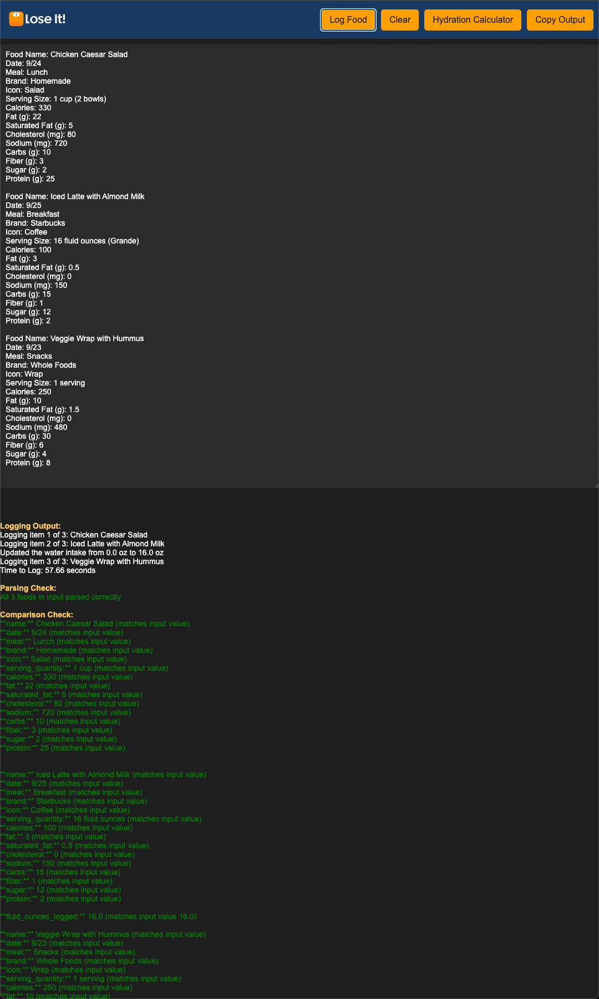
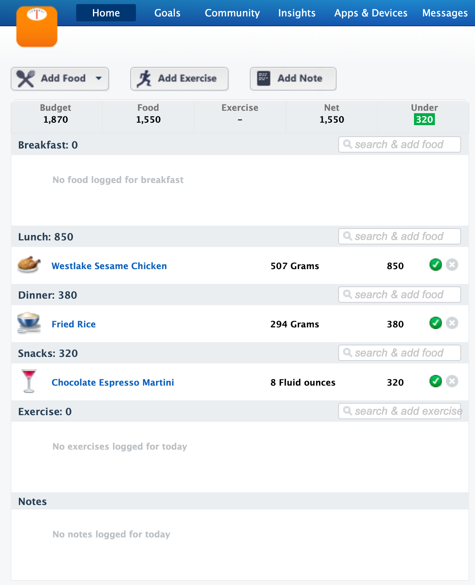

<!-- README.md -->

# Food Logging Automation

## Overview

**Food Logging Automation** is a modular project designed to streamline logging food intake into the [Lose It!](https://loseit.com) website using Selenium automation. Users can submit their food details to a custom GPT which responds with formatted food item details ready for logging. The system automatically updates water intake when drinks or soups are logged.

It integrates with the [Estimate Nutritional Info GPT](https://chatgpt.com/g/g-VJEAwPuc8-estimate-nutritional-info), allowing users to query nutritional information. By copying the GPT's output into the web interface, the system logs meals, nutritional details, and updates water intake accurately.

The application uses **Google OAuth 2.0** for secure authentication. *Originally deployed on Heroku, the project has now been migrated entirely to a Windows 11 desktop environment.* (Cloudflare is used solely for DNS A record hosting.)

---

## Key Features

- **Automated Food and Water Logging:**  
  Seamlessly log meals by querying nutritional info via GPT. The automation script automatically logs water intake when applicable.

- **Flask Web Application:**  
  Provides a user-friendly interface for entering food data and processing GPT results.

- **Secure Google OAuth 2.0 Authentication:**  
  Ensures that only authenticated users can log food.

- **Accurate Data Logging:**  
  Verifies that the nutritional data logged into Lose It! matches the user’s input.

- **Comprehensive Error Handling and Logging:**  
  Detailed logging and error reporting aid in troubleshooting.

---

## Screenshots

### Food Logging Interface  
This is the main interface where users enter food data or paste nutritional info retrieved from GPT.



### Logged Food on Lose It!  
After submitting food data, it automatically appears on your Lose It! account.




### Water Intake Logging  
After submitting a drink or soup, the water intake is automatically updated in your Lose It! account.


---

## How It Works

1. **Query Nutritional Info via GPT:**  
   Users ask the [Estimate Nutritional Info GPT](https://chatgpt.com/g/g-VJEAwPuc8-estimate-nutritional-info) about a meal. The GPT provides detailed nutritional data formatted for logging.

2. **Copy Results to Web App:**  
   The GPT output is pasted into the web app’s interface.

3. **Automated Logging:**  
   - **Food Logging:** Selenium logs into Lose It!, navigates the site, and logs the provided food data.
   - **Water Intake Logging:** When applicable, the script automatically updates water intake based on the logged food item.

4. **Validation:**  
   The system verifies that the data logged matches the input provided.

5. **Results:**  
   A confirmation message is displayed once logging is complete, and the logged data appears on Lose It!.

---

## Deployment

### Windows 11 Desktop Deployment

1. **Clone the Repository:**
   ```bash
   git clone https://github.com/yourusername/automated-food-logger.git
   cd automated-food-logger
   ```

2. **Set Up the Environment:**
   - Create and activate a Python virtual environment:
     ```batch
     python -m venv venv
     venv\Scripts\activate.bat
     ```
   - Install the required packages:
     ```batch
     pip install --upgrade pip
     pip install -r requirements.txt
     ```

3. **Running the Application:**
   - **Development Mode:**  
     Use `start_dev.bat` to stop the production service, activate the virtual environment, set `ENV=dev`, and start the Flask development server on port 5001.  
     Access the app at [http://localhost:5001/foodlog](http://localhost:5001/foodlog).
   - **Production Mode:**  
     Use `start_prod.bat` to stop any development instance and start the Flask app as a Windows service (managed by NSSM, service name: **FoodLogApp**). Nginx (configured for SSL) proxies external requests (e.g., [https://theespeys.com/foodlog](https://theespeys.com/foodlog)) to port 5001.

4. **Additional Setup (Optional):**
   - Configure Nginx for reverse proxy and SSL termination using Let’s Encrypt certificates (obtained via win-acme).
   - Use NSSM to manage the Flask app and Nginx as Windows services.

---

## Modular File Structure and Workflow

- **Authentication**: Google OAuth 2.0 in `app.py` secures user access.
- **Food Log Processing**:  
  - Users input food data at `/foodlog`.
  - On submission, `scripts/main.py` orchestrates:
    - Parsing input with `scripts/utils.py`.
    - Navigating the Lose It! website using `scripts/navigation.py`.
    - Entering food details via `scripts/food_entry.py`.
    - Updating water intake with `scripts/water_intake.py`.
    - Validating logged data.
- **Error Handling**:  
  The `retry_on_failure` decorator in various modules automatically retries Selenium operations upon common failures.

---

## License

MIT License